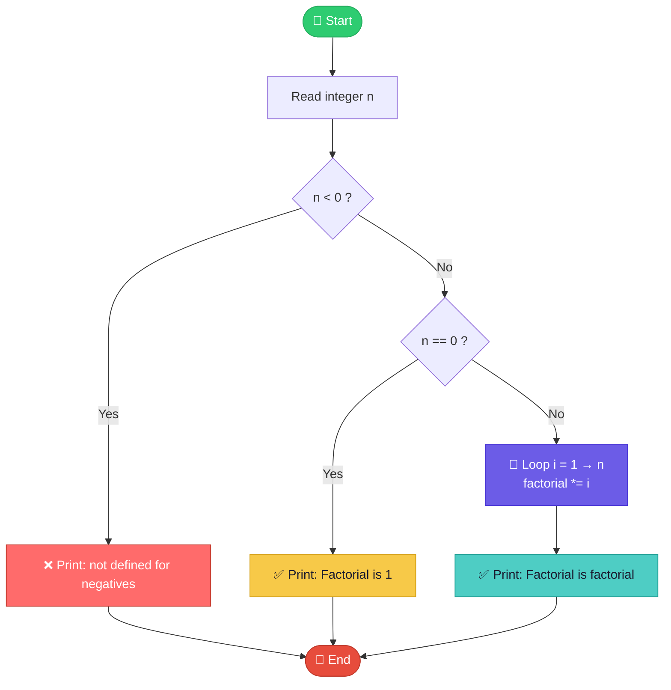

<div align="center">


<br/>


</div>

<p align="center">
  
</p>

<h1 align="center">🎩✨ The Factorial Calculator ✨🎩</h1>

<p align="center">
  <em>A tiny, elegant Python script that turns a single number into its full factorial — instantly.</em>
</p>

<p align="center">
  
</p>

---

## 📖 Table of Contents

- [What is a Factorial?](#-what-is-a-factorial)
- [How the Code Works](#-how-the-code-works)
- [Program Flow](#-program-flow)
- [Full Source Code](#-full-source-code)
- [Live Output Examples](#-live-output-examples)
- [Getting Started](#-getting-started)
- [Edge Cases Handled](#-edge-cases-handled)
- [License](#-license)

---

## 🧮 What is a Factorial?

The **factorial** of a non-negative integer `n`, written `n!`, is the product of every positive integer from `1` up to `n`.

<div align="center">

### n! = n × (n−1) × (n−2) × … × 2 × 1

| n | n! |
|:-:|:--:|
| 0 | 1 |
| 1 | 1 |
| 2 | 2 |
| 3 | 6 |
| 4 | 24 |
| 5 | 120 |
| 10 | 3,628,800 |

</div>

Factorials show up everywhere — combinatorics, probability, permutations, series expansions — which makes this humble little script surprisingly powerful.

---

## ⚙️ How the Code Works

The script does three things, in order:

1. **Reads** an integer from the user via `input()`.
2. **Branches** on the value of `n`:
   - 🔴 Negative → prints an error message (factorials aren't defined here).
   - 🟡 Zero → prints `1` directly (`0! = 1` by mathematical convention).
   - 🟢 Positive → multiplies its way up from `1` to `n` in a `for` loop.
3. **Prints** the final result.

```python
n = int(input("Enter a number: "))
if n < 0 :
    print("Factorial is not defined for negative numbers.")
elif n == 0 :
    print("Factorial is: 1")
else:
    factorial = 1
    for i in range(1, n + 1):
        factorial = factorial * i
    print("Factorial is:", factorial)
```

Clean, readable, and dependency-free — pure Python standard library, no imports needed.

---

## 🔀 Program Flow



> 💡 *GitHub renders Mermaid diagrams natively — this flowchart will animate into view when the README loads.*

---

## 💻 Full Source Code

<details>
<summary><b>Click to expand <code>factorial.py</code></b> 📂</summary>

```python
n = int(input("Enter a number: "))
if n < 0 :
    print("Factorial is not defined for negative numbers.")
elif n == 0 :
    print("Factorial is: 1")
else:
    factorial = 1
    for i in range(1, n + 1):
        factorial = factorial * i
    print("Factorial is:", factorial)
```

</details>

---


</div>

<p align="center"><sub>📸 Screenshots generated from an actual run of <code>factorial.py</code></sub></p>

---

## 🚀 Getting Started

```bash
# 1️⃣ Clone or download this repo
git clone https://github.com/your-username/factorial-calculator.git
cd factorial-calculator

# 2️⃣ Run the script
python3 factorial.py

# 3️⃣ Enter any integer when prompted
Enter a number: 7
Factorial is: 5040
```

**Requirements:** Python 3.6+ — nothing else. No `pip install`, no external packages. 🎉

---

## 🛡️ Edge Cases Handled

| Input | Behavior |
|:-----:|:---------|
| `n < 0` | Prints a friendly error — factorial isn't defined for negatives |
| `n == 0` | Correctly returns `1` (mathematical convention: `0! = 1`) |
| `n > 0` | Computes the product iteratively via a `for` loop |
| Non-integer input | ⚠️ Will raise a `ValueError` — not currently caught |

---

## 📜 License

Released under the **MIT License** — free to use, modify, and share.

<div align="center">

### ⭐ If this helped you understand factorials, consider giving it a star! ⭐


<sub>Made with 🐍 Python and a genuine appreciation for exclamation marks (`n!`)</sub>

</div>
